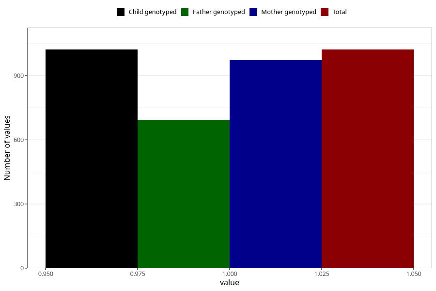

# food_allergy_intolerance_previously_18m
Variable mapping to `EE837` in `Skjema5_18mnd_v12`.
- Number of values:

| Value | Total | Child genotyped | Mother genotyped | Father genotyped |
| ----- | ----- | --------------- | ---------------- | ---------------- |
| Missing | 74286 | 74286 | 70677 | 49390 |
| Non-missing | 1022 | 1022 | 973 | 694 |
| 1 | 1022 | 1022 | 973 | 694 |

