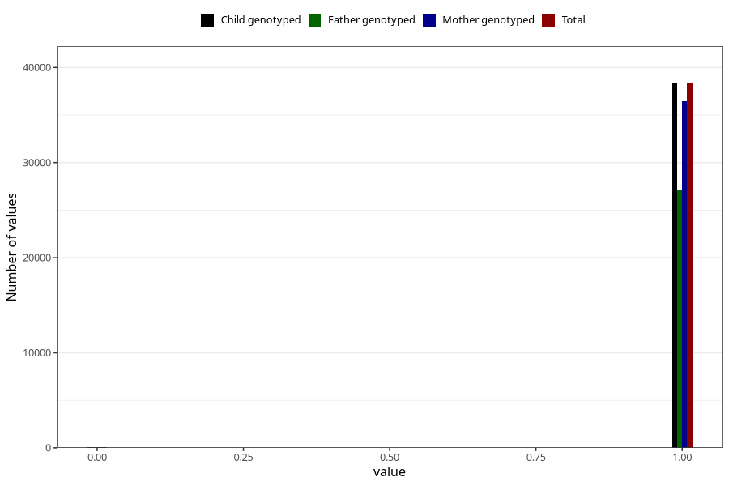

# frequent_stomach_pain_no_3y
Variable mapping to `GG570` in `Skjema6_3aar_v12`.
- Number of values:

| Value | Total | Child genotyped | Mother genotyped | Father genotyped |
| ----- | ----- | --------------- | ---------------- | ---------------- |
| Missing | 36815 | 36815 | 35107 | 22977 |
| Non-missing | 38493 | 38493 | 36543 | 27107 |
| 0 | 103 | 103 | 96 | 71 |
| 1 | 38390 | 38390 | 36447 | 27036 |

