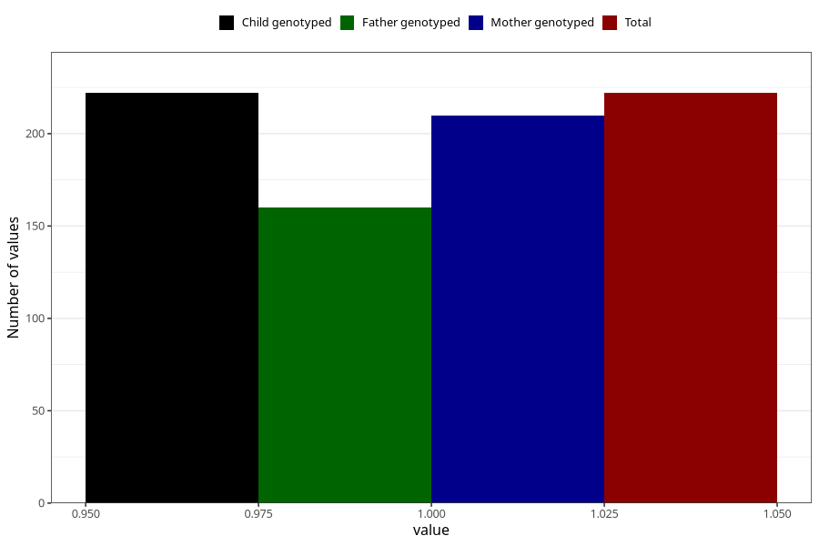

# heart_defect_yes_3y
Variable mapping to `GG62` in `Skjema6_3aar_v12`.
- Number of values:

| Value | Total | Child genotyped | Mother genotyped | Father genotyped |
| ----- | ----- | --------------- | ---------------- | ---------------- |
| Missing | 75086 | 75086 | 71440 | 49924 |
| Non-missing | 222 | 222 | 210 | 160 |
| 1 | 222 | 222 | 210 | 160 |

