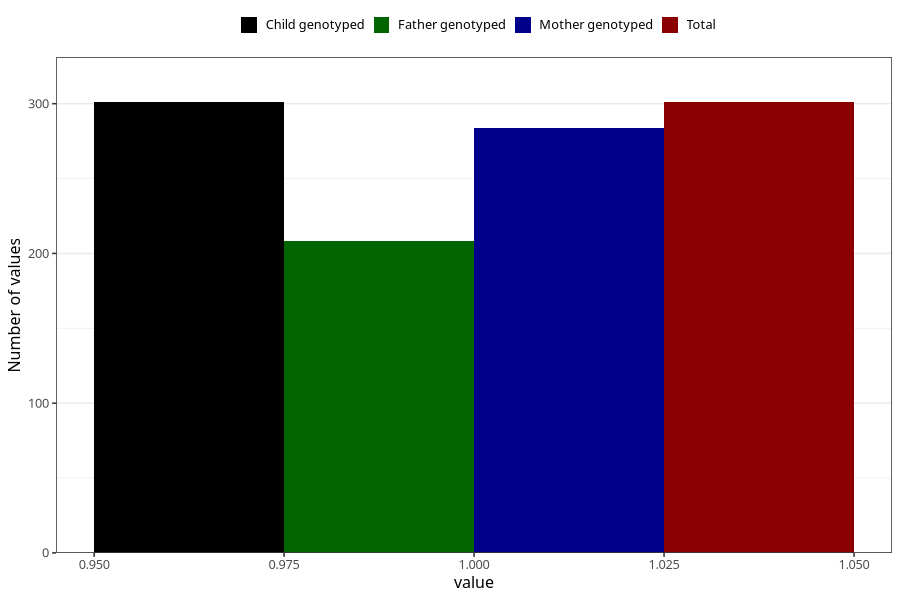

# hives_yes_18m
Variable mapping to `EE832` in `Skjema5_18mnd_v12`.
- Number of values:

| Value | Total | Child genotyped | Mother genotyped | Father genotyped |
| ----- | ----- | --------------- | ---------------- | ---------------- |
| Missing | 75007 | 75007 | 71366 | 49876 |
| Non-missing | 301 | 301 | 284 | 208 |
| 1 | 301 | 301 | 284 | 208 |

