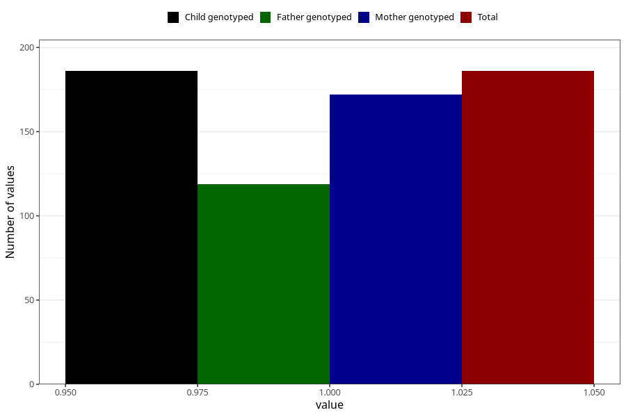

# hyperactivity_past_8y
Variable mapping to `NN46` in `Skjema8aar_v12`.
- Number of values:

| Value | Total | Child genotyped | Mother genotyped | Father genotyped |
| ----- | ----- | --------------- | ---------------- | ---------------- |
| Missing | 75122 | 75122 | 71478 | 49965 |
| Non-missing | 186 | 186 | 172 | 119 |
| 1 | 186 | 186 | 172 | 119 |

