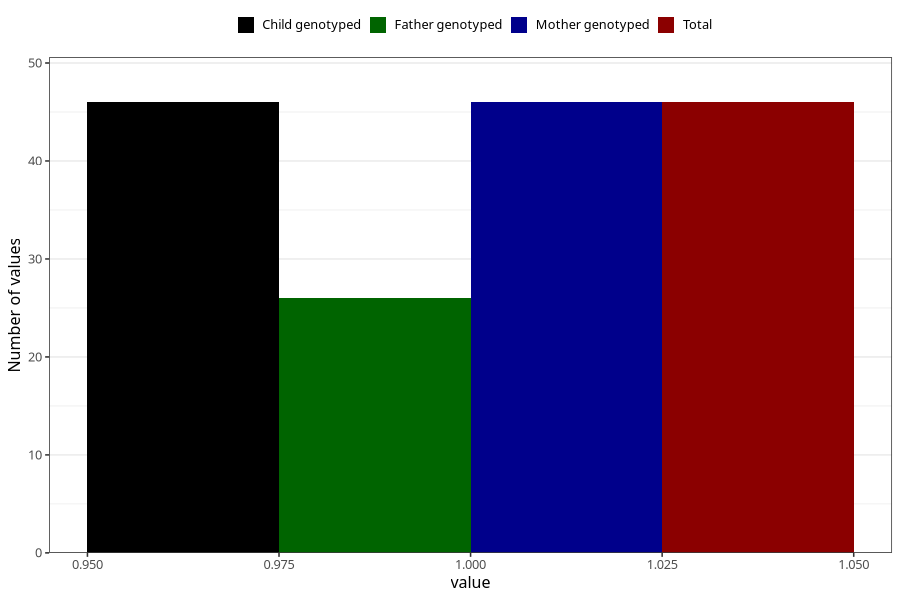

# hyperactivity_previous_3y
Variable mapping to `GG107` in `Skjema6_3aar_v12`.
- Number of values:

| Value | Total | Child genotyped | Mother genotyped | Father genotyped |
| ----- | ----- | --------------- | ---------------- | ---------------- |
| Missing | 75262 | 75262 | 71604 | 50058 |
| Non-missing | 46 | 46 | 46 | 26 |
| 1 | 46 | 46 | 46 | 26 |

