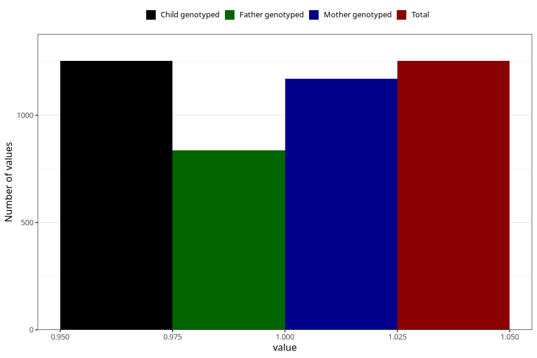

# impaired_hearing_previous_3y
Variable mapping to `GG31` in `Skjema6_3aar_v12`.
- Number of values:

| Value | Total | Child genotyped | Mother genotyped | Father genotyped |
| ----- | ----- | --------------- | ---------------- | ---------------- |
| Missing | 74055 | 74055 | 70479 | 49247 |
| Non-missing | 1253 | 1253 | 1171 | 837 |
| 1 | 1253 | 1253 | 1171 | 837 |

