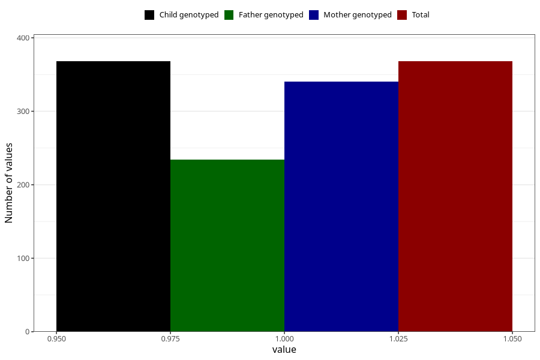

# impaired_hearing_yes_18m
Variable mapping to `EE792` in `Skjema5_18mnd_v12`.
- Number of values:

| Value | Total | Child genotyped | Mother genotyped | Father genotyped |
| ----- | ----- | --------------- | ---------------- | ---------------- |
| Missing | 74940 | 74940 | 71310 | 49850 |
| Non-missing | 368 | 368 | 340 | 234 |
| 1 | 368 | 368 | 340 | 234 |

