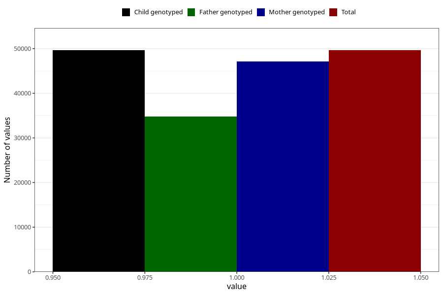

# impaired_vision_no_18m
Variable mapping to `EE795` in `Skjema5_18mnd_v12`.
- Number of values:

| Value | Total | Child genotyped | Mother genotyped | Father genotyped |
| ----- | ----- | --------------- | ---------------- | ---------------- |
| Missing | 25672 | 25672 | 24497 | 15294 |
| Non-missing | 49636 | 49636 | 47153 | 34790 |
| 1 | 49636 | 49636 | 47153 | 34790 |

