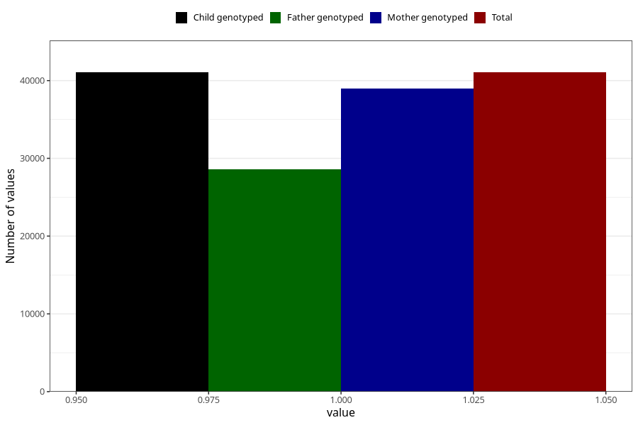

# joint_problems_no_3y
Variable mapping to `GG45` in `Skjema6_3aar_v12`.
- Number of values:

| Value | Total | Child genotyped | Mother genotyped | Father genotyped |
| ----- | ----- | --------------- | ---------------- | ---------------- |
| Missing | 34255 | 34255 | 32638 | 21473 |
| Non-missing | 41053 | 41053 | 39012 | 28611 |
| 1 | 41053 | 41053 | 39012 | 28611 |

