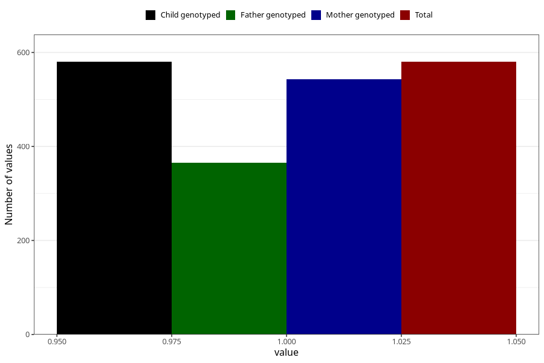

# late_or_abnormal_speech_development_previous_3y
Variable mapping to `GG95` in `Skjema6_3aar_v12`.
- Number of values:

| Value | Total | Child genotyped | Mother genotyped | Father genotyped |
| ----- | ----- | --------------- | ---------------- | ---------------- |
| Missing | 74728 | 74728 | 71107 | 49719 |
| Non-missing | 580 | 580 | 543 | 365 |
| 1 | 580 | 580 | 543 | 365 |

