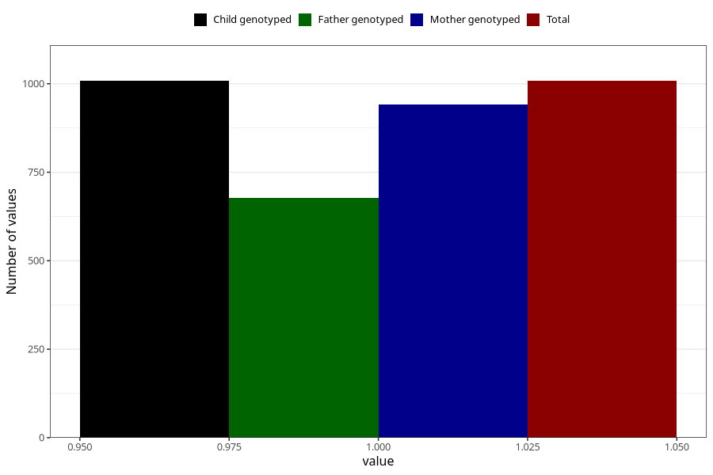

# late_or_abnormal_speech_development_yes_3y
Variable mapping to `GG94` in `Skjema6_3aar_v12`.
- Number of values:

| Value | Total | Child genotyped | Mother genotyped | Father genotyped |
| ----- | ----- | --------------- | ---------------- | ---------------- |
| Missing | 74300 | 74300 | 70709 | 49407 |
| Non-missing | 1008 | 1008 | 941 | 677 |
| 1 | 1008 | 1008 | 941 | 677 |

