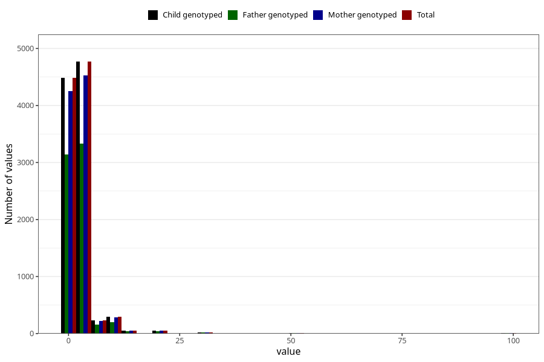

# nappy_rash_freq_6m
Variable mapping to `DD308` in `Skjema4_6mnd_v12`.
- Number of values:

| Value | Total | Child genotyped | Mother genotyped | Father genotyped |
| ----- | ----- | --------------- | ---------------- | ---------------- |
| Missing | 65376 | 65376 | 62212 | 43149 |
| Non-missing | 9932 | 9932 | 9438 | 6935 |
| 25th percentile | 1 | 1 | 1 | 1 |
| 50th percentile | 2 | 2 | 2 | 2 |
| 75th percentile | 3 | 3 | 3 | 3 |
| Mean | 2.70257752718486 | 2.70257752718486 | 2.70470438652257 | 2.65090122566691 |
| Standard deviation | 4.67219049410677 | 4.67219049410677 | 4.64389416404025 | 4.3100193147715 |
| N | 9932 | 9932 | 9438 | 6935 |

