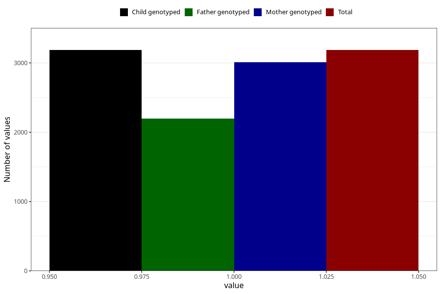

# other_conditions_congenital_syndroms_7y
Variable mapping to `JJ441` in `Skjema7aar_v12`.
- Number of values:

| Value | Total | Child genotyped | Mother genotyped | Father genotyped |
| ----- | ----- | --------------- | ---------------- | ---------------- |
| Missing | 72123 | 72123 | 68641 | 47890 |
| Non-missing | 3185 | 3185 | 3009 | 2194 |
| 1 | 3185 | 3185 | 3009 | 2194 |

