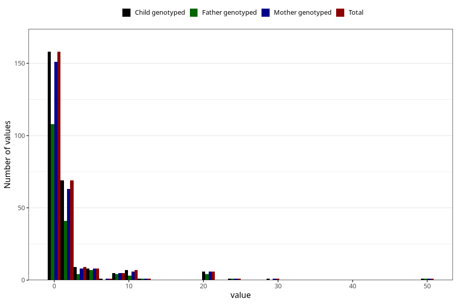

# other_convulsions_no_fever_number_6_11m
Variable mapping to `EE261` in `Skjema5_18mnd_v12`.
- Number of values:

| Value | Total | Child genotyped | Mother genotyped | Father genotyped |
| ----- | ----- | --------------- | ---------------- | ---------------- |
| Missing | 75039 | 75039 | 71396 | 49909 |
| Non-missing | 269 | 269 | 254 | 175 |
| Filled in text or mark instead of number | 2 | 2 | 2 |1 |
| 0 | 158 | 158 | 151 | 108 |
| 1 | 46 | 46 | 43 | 26 |
| 2 | 23 | 23 | 20 | 15 |
| 3 | 5 | 5 | 4 | 2 |
| 4 | 4 | 4 | 4 | 2 |
| 5 | 6 | 6 | 6 | 5 |
| 6 | 2 | 2 | 2 | 2 |
| 7 | 1 | 1 | 1 | 0 |
| 8 | 3 | 3 | 3 | 2 |
| 9 | 2 | 2 | 2 | 2 |
| 10 | 6 | 6 | 5 | 2 |
| 11 | 1 | 1 | 1 | 1 |
| 12 | 1 | 1 | 1 | 1 |
| 20 | 6 | 6 | 6 | 4 |
| 25 | 1 | 1 | 1 | 1 |
| 30 | 1 | 1 | 1 | 0 |
| 50 | 1 | 1 | 1 | 1 |

