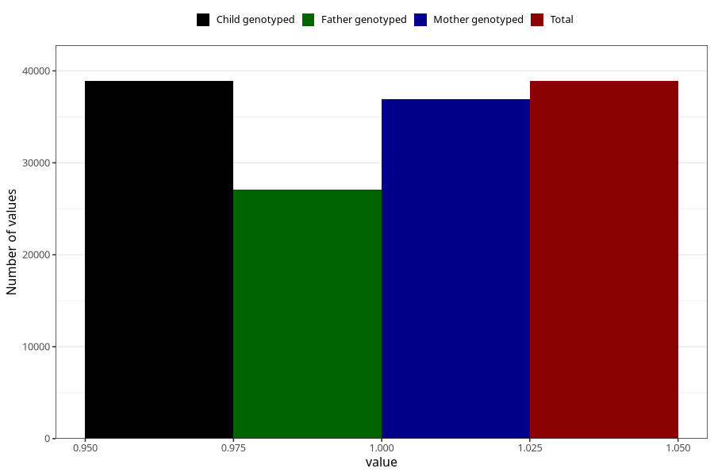

# other_eczema_no_3y
Variable mapping to `GG81` in `Skjema6_3aar_v12`.
- Number of values:

| Value | Total | Child genotyped | Mother genotyped | Father genotyped |
| ----- | ----- | --------------- | ---------------- | ---------------- |
| Missing | 36417 | 36417 | 34699 | 22996 |
| Non-missing | 38891 | 38891 | 36951 | 27088 |
| 1 | 38891 | 38891 | 36951 | 27088 |

