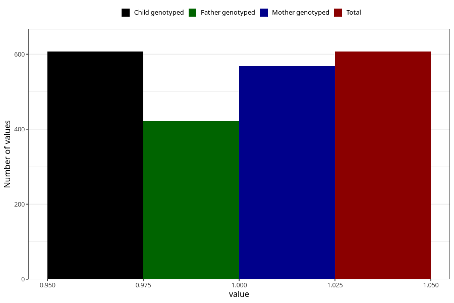

# other_malformations_yes_18m
Variable mapping to `EE852` in `Skjema5_18mnd_v12`.
- Number of values:

| Value | Total | Child genotyped | Mother genotyped | Father genotyped |
| ----- | ----- | --------------- | ---------------- | ---------------- |
| Missing | 74701 | 74701 | 71082 | 49662 |
| Non-missing | 607 | 607 | 568 | 422 |
| 1 | 607 | 607 | 568 | 422 |

