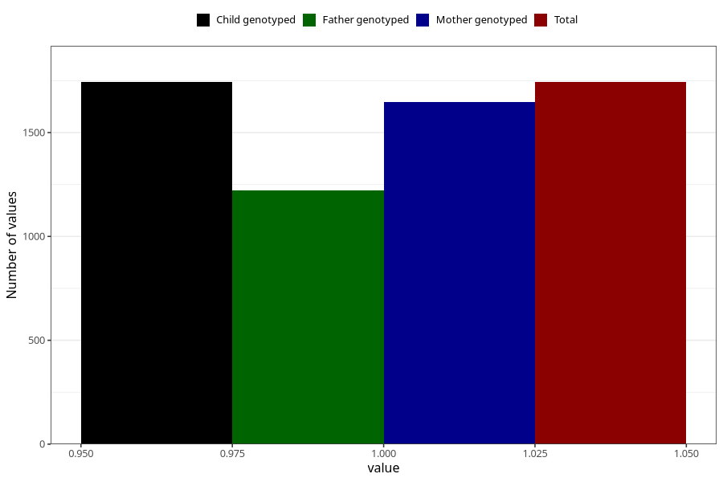

# other_yes_18m
Variable mapping to `EE857` in `Skjema5_18mnd_v12`.
- Number of values:

| Value | Total | Child genotyped | Mother genotyped | Father genotyped |
| ----- | ----- | --------------- | ---------------- | ---------------- |
| Missing | 73565 | 73565 | 70004 | 48863 |
| Non-missing | 1743 | 1743 | 1646 | 1221 |
| 1 | 1743 | 1743 | 1646 | 1221 |

