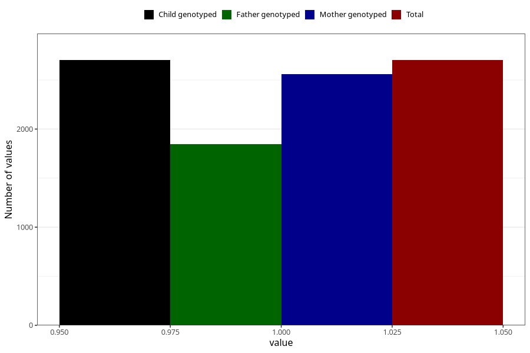

# removed_tonsils_7y
Variable mapping to `JJ439` in `Skjema7aar_v12`.
- Number of values:

| Value | Total | Child genotyped | Mother genotyped | Father genotyped |
| ----- | ----- | --------------- | ---------------- | ---------------- |
| Missing | 72605 | 72605 | 69090 | 48235 |
| Non-missing | 2703 | 2703 | 2560 | 1849 |
| 1 | 2703 | 2703 | 2560 | 1849 |

