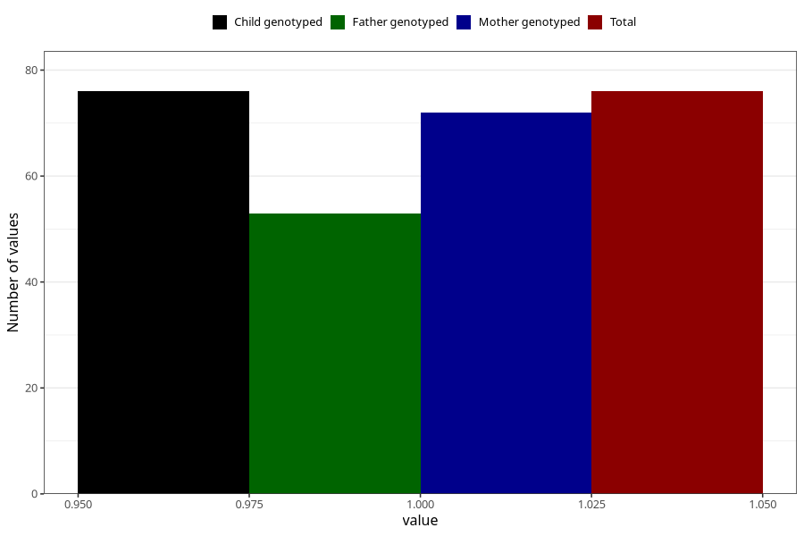

# rheumatoid_arthritis_8y
Variable mapping to `NN26` in `Skjema8aar_v12`.
- Number of values:

| Value | Total | Child genotyped | Mother genotyped | Father genotyped |
| ----- | ----- | --------------- | ---------------- | ---------------- |
| Missing | 75232 | 75232 | 71578 | 50031 |
| Non-missing | 76 | 76 | 72 | 53 |
| 1 | 76 | 76 | 72 | 53 |

