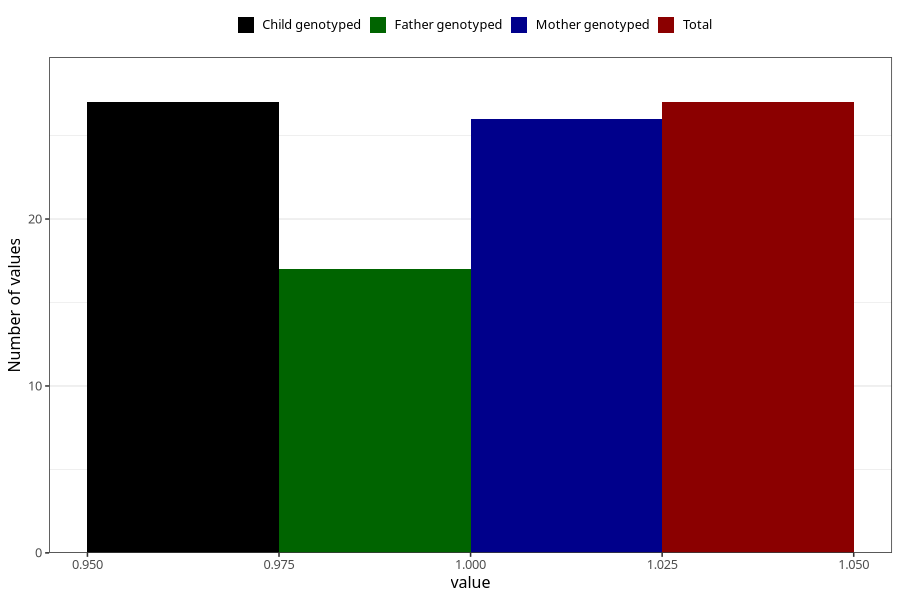

# social_problems_yes_18m
Variable mapping to `EE968` in `Skjema5_18mnd_v12`.
- Number of values:

| Value | Total | Child genotyped | Mother genotyped | Father genotyped |
| ----- | ----- | --------------- | ---------------- | ---------------- |
| Missing | 75281 | 75281 | 71624 | 50067 |
| Non-missing | 27 | 27 | 26 | 17 |
| 1 | 27 | 27 | 26 | 17 |

