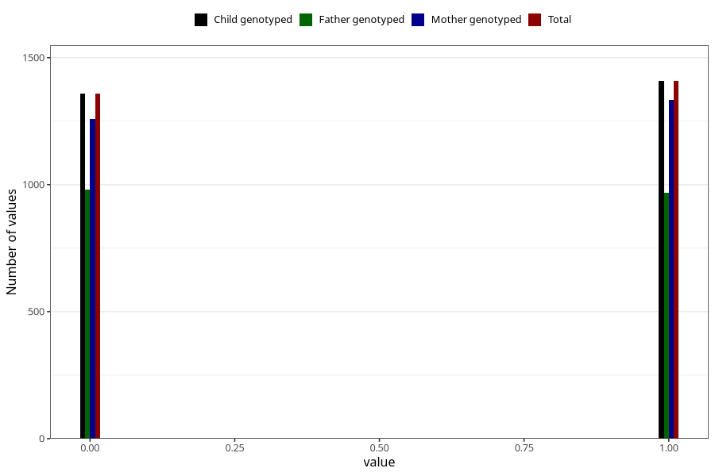

# specialist_diagnosis_2_3y
Variable mapping to `GG120` in `Skjema6_3aar_v12`.
- Number of values:

| Value | Total | Child genotyped | Mother genotyped | Father genotyped |
| ----- | ----- | --------------- | ---------------- | ---------------- |
| Missing | 72542 | 72542 | 69058 | 48137 |
| Non-missing | 2766 | 2766 | 2592 | 1947 |
| 0 | 1358 | 1358 | 1258 | 980 |
| 1 | 1408 | 1408 | 1334 | 967 |

