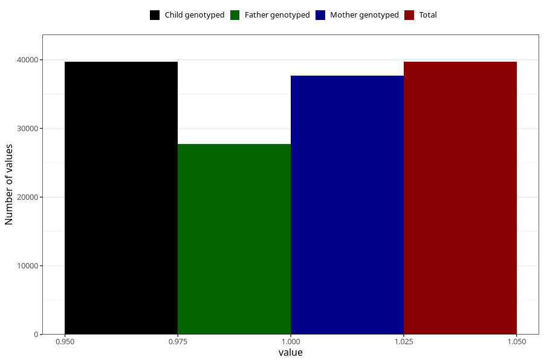

# testicles_not_descended_scrotum_no_3y
Variable mapping to `GG65` in `Skjema6_3aar_v12`.
- Number of values:

| Value | Total | Child genotyped | Mother genotyped | Father genotyped |
| ----- | ----- | --------------- | ---------------- | ---------------- |
| Missing | 35611 | 35611 | 33935 | 22390 |
| Non-missing | 39697 | 39697 | 37715 | 27694 |
| 1 | 39697 | 39697 | 37715 | 27694 |

