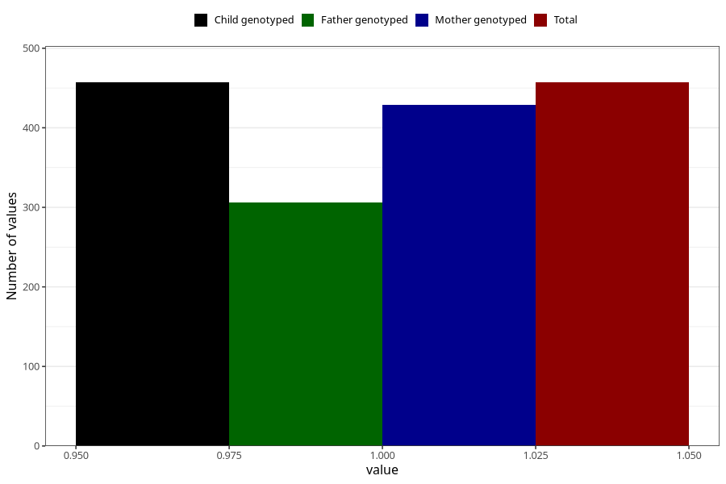

# testicles_not_descended_scrotum_previous_3y
Variable mapping to `GG67` in `Skjema6_3aar_v12`.
- Number of values:

| Value | Total | Child genotyped | Mother genotyped | Father genotyped |
| ----- | ----- | --------------- | ---------------- | ---------------- |
| Missing | 74851 | 74851 | 71221 | 49778 |
| Non-missing | 457 | 457 | 429 | 306 |
| 1 | 457 | 457 | 429 | 306 |

