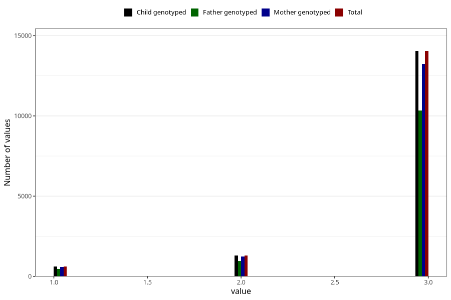

# vaccine_pneumococcus_freq_18m
Variable mapping to `EE1009` in `Skjema5_18mnd_v12`.
- Number of values:

| Value | Total | Child genotyped | Mother genotyped | Father genotyped |
| ----- | ----- | --------------- | ---------------- | ---------------- |
| Missing | 59349 | 59349 | 56594 | 38348 |
| Non-missing | 15959 | 15959 | 15056 | 11736 |
| 1 | 630 | 630 | 594 | 457 |
| 2 | 1292 | 1292 | 1227 | 947 |
| 3 | 14037 | 14037 | 13235 | 10332 |

