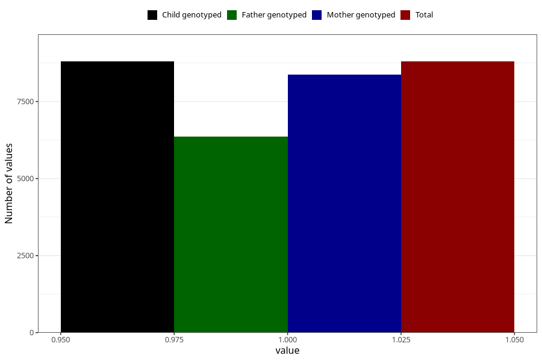

# youth_self_boy
Variable mapping to `UB226` in `Ungdomsskjema_Barn_v12_standard`.
- Number of values:

| Value | Total | Child genotyped | Mother genotyped | Father genotyped |
| ----- | ----- | --------------- | ---------------- | ---------------- |
| Missing | 66510 | 66510 | 63285 | 43721 |
| Non-missing | 8798 | 8798 | 8365 | 6363 |
| 1 | 8798 | 8798 | 8365 | 6363 |

