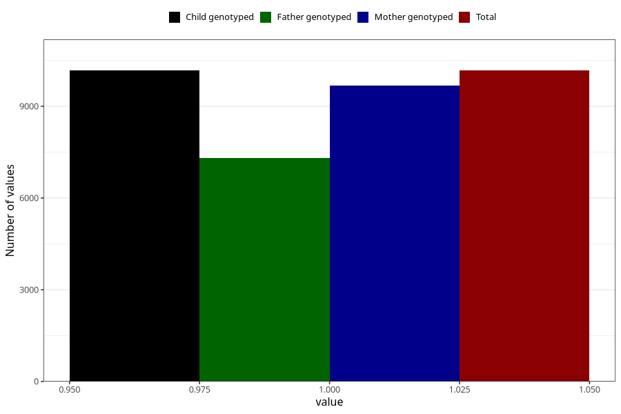

# youth_self_girl
Variable mapping to `UB225` in `Ungdomsskjema_Barn_v12_standard`.
- Number of values:

| Value | Total | Child genotyped | Mother genotyped | Father genotyped |
| ----- | ----- | --------------- | ---------------- | ---------------- |
| Missing | 65140 | 65140 | 61981 | 42772 |
| Non-missing | 10168 | 10168 | 9669 | 7312 |
| 1 | 10168 | 10168 | 9669 | 7312 |

