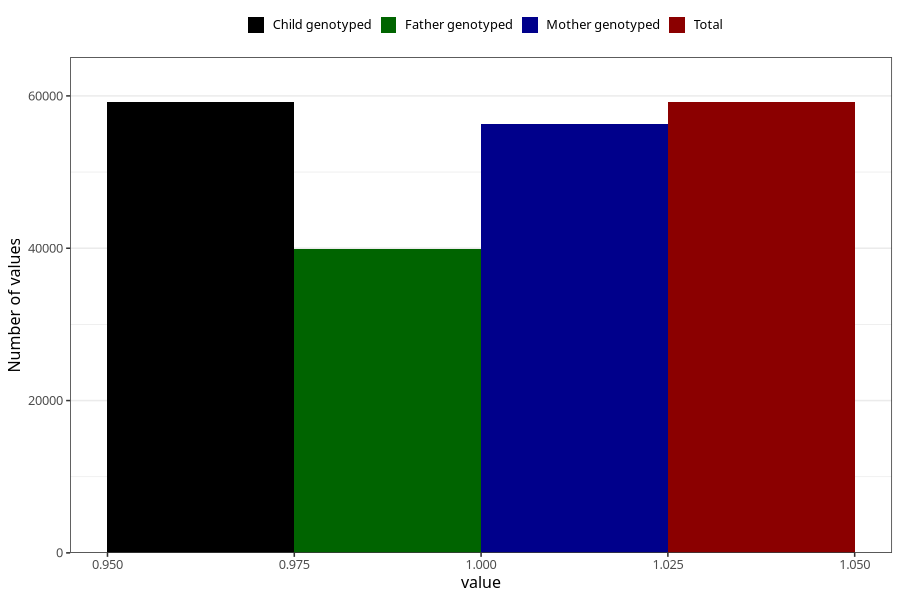

# breastmilk_3m
Variable mapping to `DD52` in `Skjema4_6mnd_v12`.
- Number of values:

| Value | Total | Child genotyped | Mother genotyped | Father genotyped |
| ----- | ----- | --------------- | ---------------- | ---------------- |
| Missing | 16135 | 16135 | 15310 | 10155 |
| Non-missing | 59173 | 59173 | 56340 | 39929 |
| 1 | 59173 | 59173 | 56340 | 39929 |

