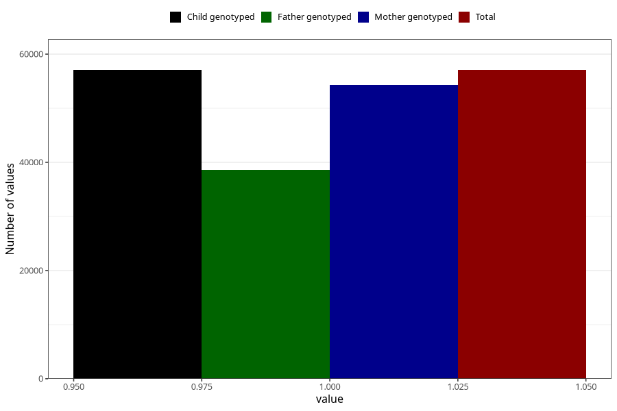

# breastmilk_4m
Variable mapping to `DD53` in `Skjema4_6mnd_v12`.
- Number of values:

| Value | Total | Child genotyped | Mother genotyped | Father genotyped |
| ----- | ----- | --------------- | ---------------- | ---------------- |
| Missing | 18243 | 18243 | 17315 | 11536 |
| Non-missing | 57065 | 57065 | 54335 | 38548 |
| 1 | 57065 | 57065 | 54335 | 38548 |

