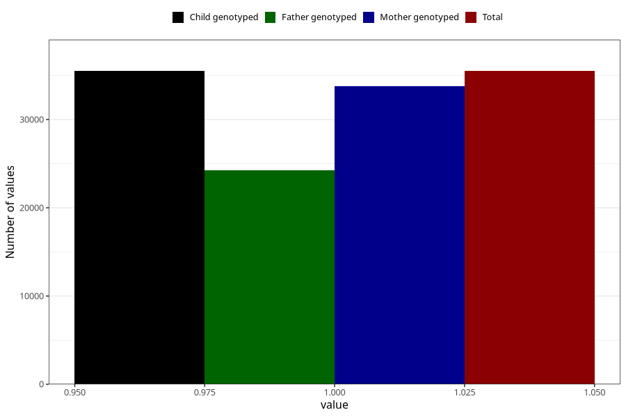

# breastmilk_9_11m
Variable mapping to `EE13` in `Skjema5_18mnd_v12`.
- Number of values:

| Value | Total | Child genotyped | Mother genotyped | Father genotyped |
| ----- | ----- | --------------- | ---------------- | ---------------- |
| Missing | 39806 | 39806 | 37837 | 25826 |
| Non-missing | 35502 | 35502 | 33813 | 24258 |
| 1 | 35502 | 35502 | 33813 | 24258 |

