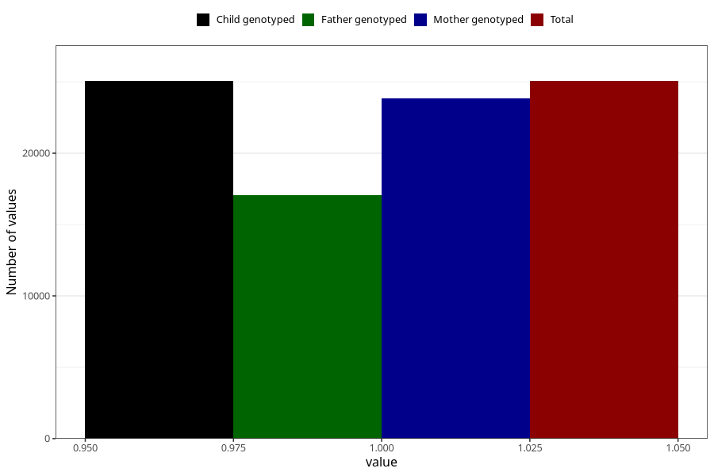

# formula_9_11m
Variable mapping to `EE17` in `Skjema5_18mnd_v12`.
- Number of values:

| Value | Total | Child genotyped | Mother genotyped | Father genotyped |
| ----- | ----- | --------------- | ---------------- | ---------------- |
| Missing | 50256 | 50256 | 47801 | 33046 |
| Non-missing | 25052 | 25052 | 23849 | 17038 |
| 1 | 25052 | 25052 | 23849 | 17038 |

