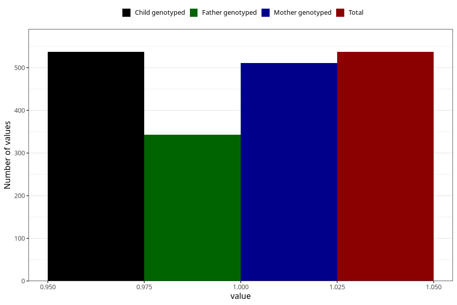

# formula_colett_1m
Variable mapping to `DD57` in `Skjema4_6mnd_v12`.
- Number of values:

| Value | Total | Child genotyped | Mother genotyped | Father genotyped |
| ----- | ----- | --------------- | ---------------- | ---------------- |
| Missing | 74771 | 74771 | 71139 | 49741 |
| Non-missing | 537 | 537 | 511 | 343 |
| 1 | 537 | 537 | 511 | 343 |

