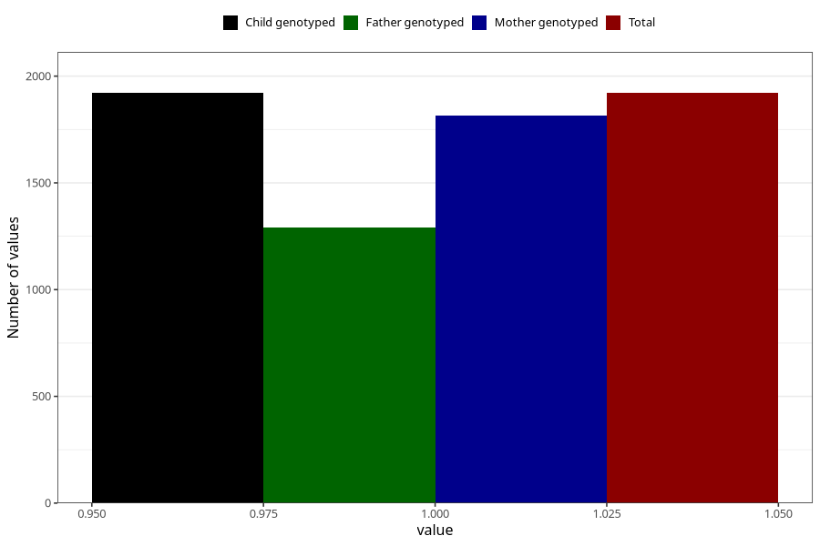

# formula_colett_omega3_0m
Variable mapping to `DD63` in `Skjema4_6mnd_v12`.
- Number of values:

| Value | Total | Child genotyped | Mother genotyped | Father genotyped |
| ----- | ----- | --------------- | ---------------- | ---------------- |
| Missing | 73387 | 73387 | 69836 | 48793 |
| Non-missing | 1921 | 1921 | 1814 | 1291 |
| 1 | 1921 | 1921 | 1814 | 1291 |

