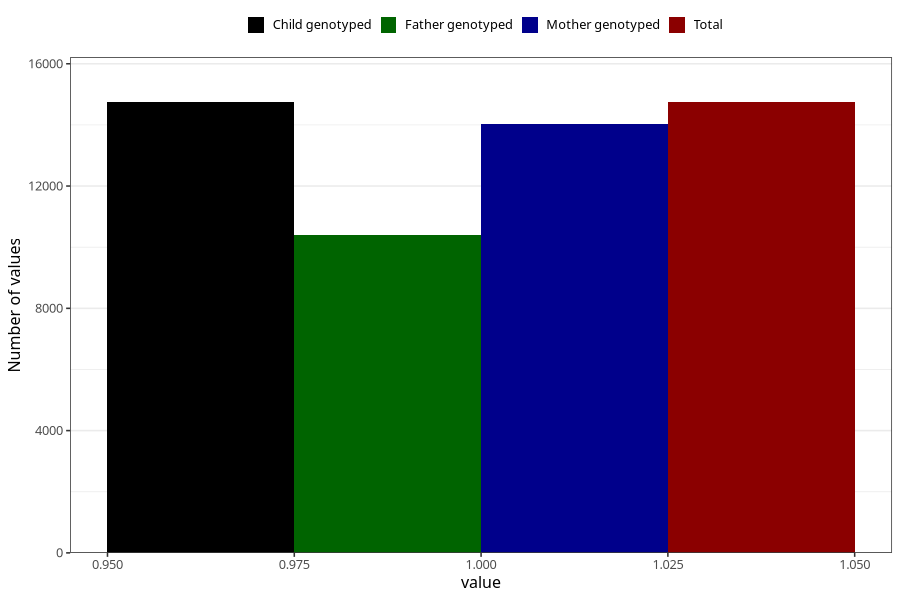

# formula_nan_6m
Variable mapping to `DD76` in `Skjema4_6mnd_v12`.
- Number of values:

| Value | Total | Child genotyped | Mother genotyped | Father genotyped |
| ----- | ----- | --------------- | ---------------- | ---------------- |
| Missing | 60565 | 60565 | 57626 | 39688 |
| Non-missing | 14743 | 14743 | 14024 | 10396 |
| 1 | 14743 | 14743 | 14024 | 10396 |

