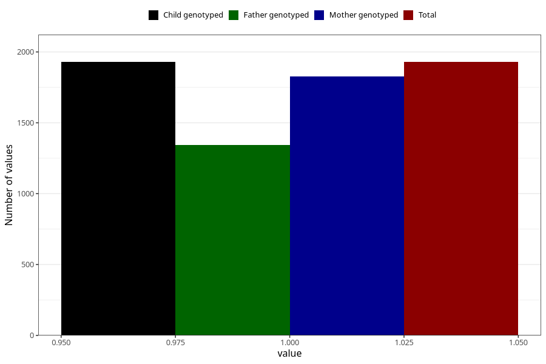

# formula_nan_ha1_5m
Variable mapping to `DD82` in `Skjema4_6mnd_v12`.
- Number of values:

| Value | Total | Child genotyped | Mother genotyped | Father genotyped |
| ----- | ----- | --------------- | ---------------- | ---------------- |
| Missing | 73379 | 73379 | 69822 | 48739 |
| Non-missing | 1929 | 1929 | 1828 | 1345 |
| 1 | 1929 | 1929 | 1828 | 1345 |

