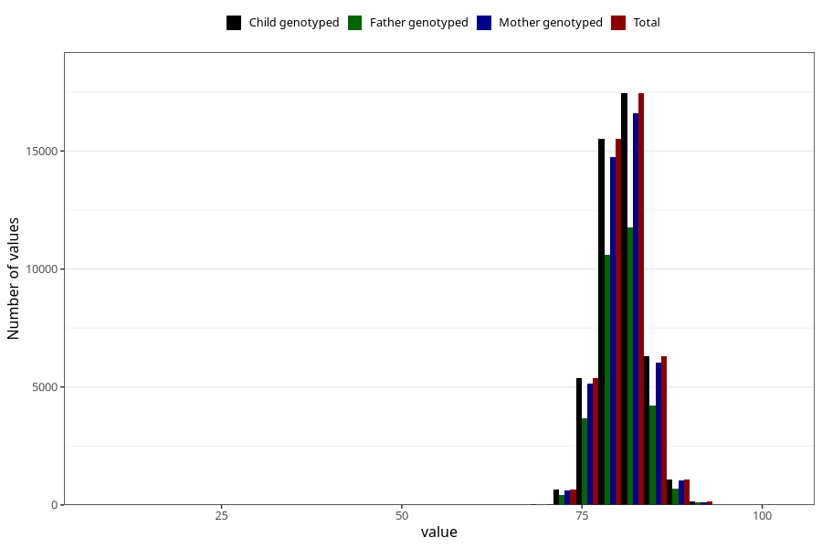

# length_15_18m_1
Variable mapping to `EE399` in `Skjema5_18mnd_v12`.
- Number of values:

| Value | Total | Child genotyped | Mother genotyped | Father genotyped |
| ----- | ----- | --------------- | ---------------- | ---------------- |
| Missing | 28810 | 28810 | 27353 | 18593 |
| Non-missing | 46498 | 46498 | 44297 | 31491 |
| 25th percentile | 78.6 | 78.6 | 78.5 | 78.5 |
| 50th percentile | 80.5 | 80.5 | 80.5 | 80.5 |
| 75th percentile | 82.6 | 82.6 | 82.7 | 82.5 |
| Mean | 80.690175921545 | 80.690175921545 | 80.6904350181728 | 80.6710679241688 |
| Standard deviation | 3.11669667200345 | 3.11669667200345 | 3.12544328558043 | 3.06060479033478 |
| N | 46498 | 46498 | 44297 | 31491 |

