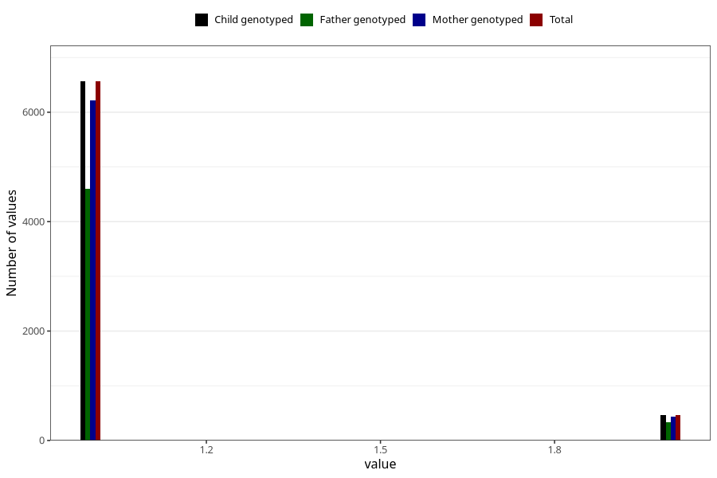

# multivitamins_capsules_amount_per_time_7y
Variable mapping to `JJ538` in `Skjema7aar_v12`.
Variable mapping to `JJ538` in `Skjema7aar_v12`.
- Number of values:

| Value | Total | Child genotyped | Mother genotyped | Father genotyped |
| ----- | ----- | --------------- | ---------------- | ---------------- |
| Missing | 68270 | 68270 | 64982 | 45140 |
| Non-missing | 7038 | 7038 | 6668 | 4944 |
| 3+ at a time | 14 | 14 | 14 |9 |
| More than 1 check box filled in | 3 | 3 | 3 |2 |
| 1 | 6563 | 6563 | 6213 | 4602 |
| 2 | 458 | 458 | 438 | 331 |

