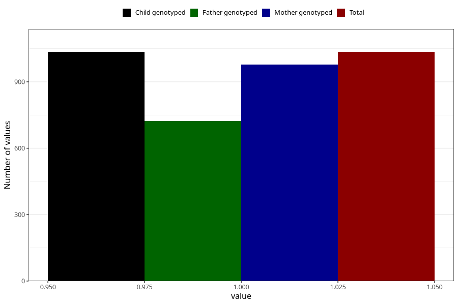

# other_milk_0m
Variable mapping to `DD84` in `Skjema4_6mnd_v12`.
- Number of values:

| Value | Total | Child genotyped | Mother genotyped | Father genotyped |
| ----- | ----- | --------------- | ---------------- | ---------------- |
| Missing | 74273 | 74273 | 70673 | 49361 |
| Non-missing | 1035 | 1035 | 977 | 723 |
| 1 | 1035 | 1035 | 977 | 723 |

