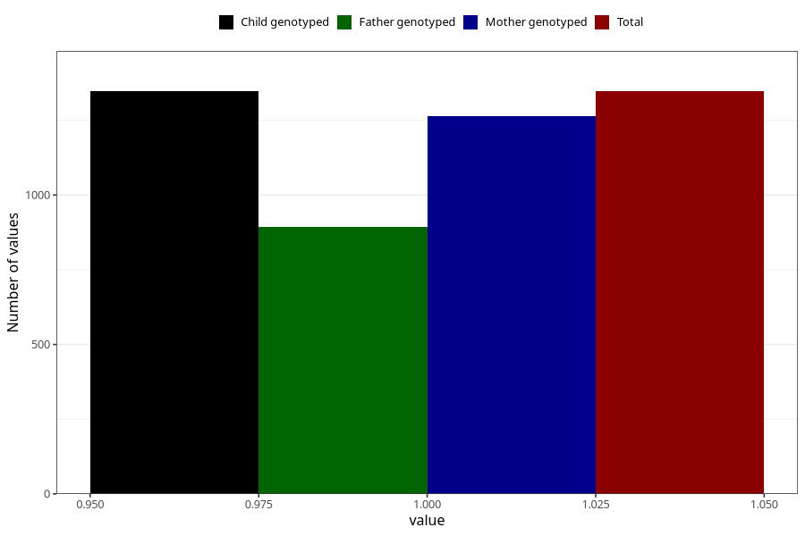

# other_milk_3m
Variable mapping to `DD87` in `Skjema4_6mnd_v12`.
- Number of values:

| Value | Total | Child genotyped | Mother genotyped | Father genotyped |
| ----- | ----- | --------------- | ---------------- | ---------------- |
| Missing | 73961 | 73961 | 70387 | 49191 |
| Non-missing | 1347 | 1347 | 1263 | 893 |
| 1 | 1347 | 1347 | 1263 | 893 |

