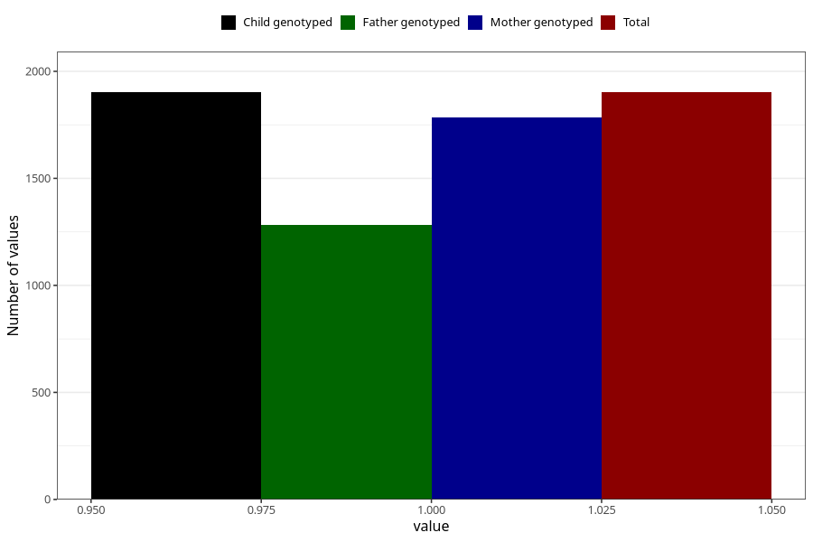

# other_milk_4m
Variable mapping to `DD88` in `Skjema4_6mnd_v12`.
- Number of values:

| Value | Total | Child genotyped | Mother genotyped | Father genotyped |
| ----- | ----- | --------------- | ---------------- | ---------------- |
| Missing | 73406 | 73406 | 69867 | 48800 |
| Non-missing | 1902 | 1902 | 1783 | 1284 |
| 1 | 1902 | 1902 | 1783 | 1284 |

