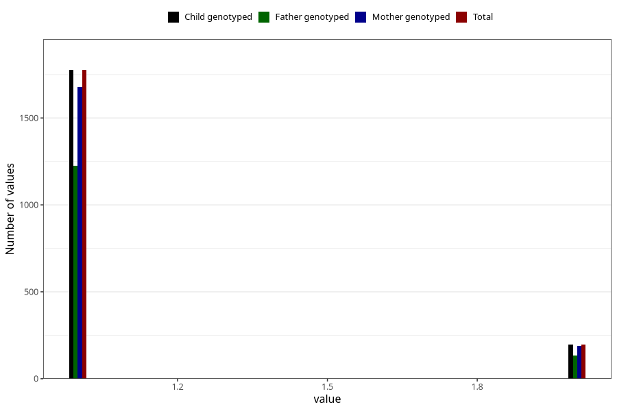

# other_supplement_capsules_amount_per_time_7y
Variable mapping to `JJ542` in `Skjema7aar_v12`.
Variable mapping to `JJ542` in `Skjema7aar_v12`.
- Number of values:

| Value | Total | Child genotyped | Mother genotyped | Father genotyped |
| ----- | ----- | --------------- | ---------------- | ---------------- |
| Missing | 73280 | 73280 | 69737 | 48691 |
| Non-missing | 2028 | 2028 | 1913 | 1393 |
| 3+ at a time | 52 | 52 | 46 |29 |
| More than 1 check box filled in | 2 | 2 | 2 |2 |
| 1 | 1776 | 1776 | 1678 | 1227 |
| 2 | 198 | 198 | 187 | 135 |

