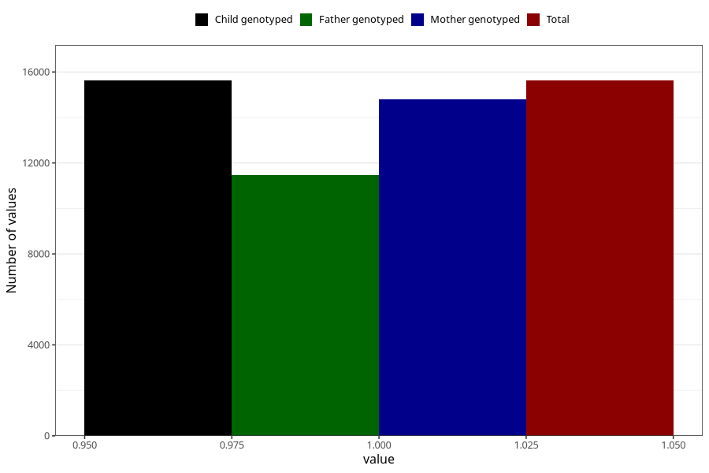

# other_supplement_liquid_5y
Variable mapping to `LL474` in `Skjema5aar_v12`.
- Number of values:

| Value | Total | Child genotyped | Mother genotyped | Father genotyped |
| ----- | ----- | --------------- | ---------------- | ---------------- |
| Missing | 59685 | 59685 | 56865 | 38619 |
| Non-missing | 15623 | 15623 | 14785 | 11465 |
| 1 | 15623 | 15623 | 14785 | 11465 |

