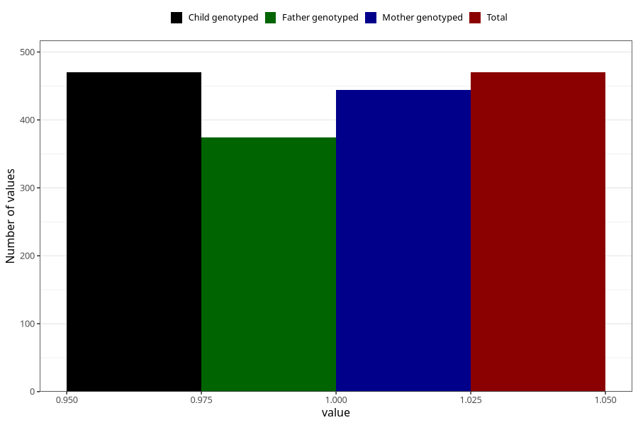

# father_diabetes
Variable mapping to `FF149` in `SkjemaFar_v12`.
- Number of values:

| Value | Total | Child genotyped | Mother genotyped | Father genotyped |
| ----- | ----- | --------------- | ---------------- | ---------------- |
| Missing | 74838 | 74838 | 71206 | 49710 |
| Non-missing | 470 | 470 | 444 | 374 |
| 1 | 470 | 470 | 444 | 374 |

