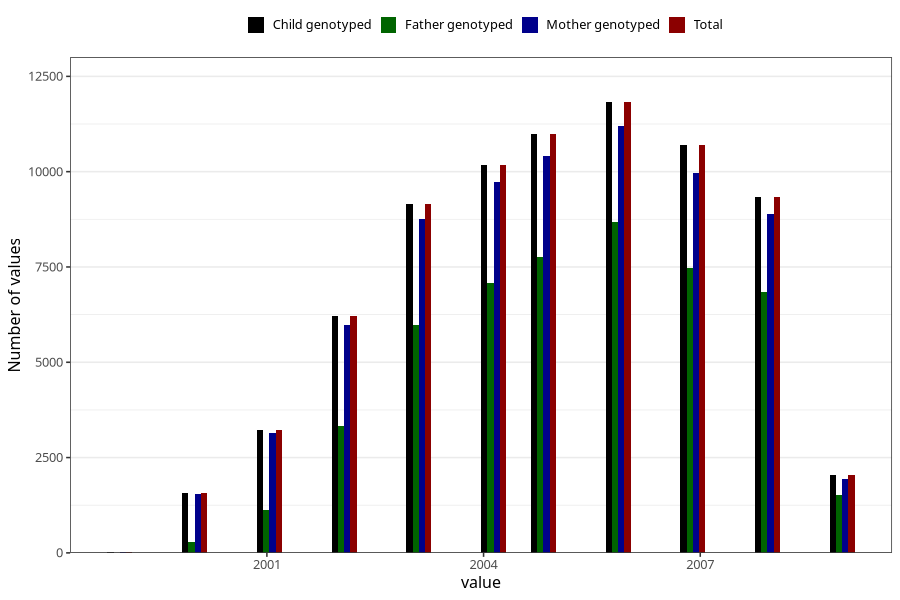

# birth_year
Variable mapping to `FAAR` in `MFR_541_v12`.
- Number of values:

| Value | Total | Child genotyped | Mother genotyped | Father genotyped |
| ----- | ----- | --------------- | ---------------- | ---------------- |
| Missing | 61 | 61 | 57 | 40 |
| Non-missing | 75247 | 75247 | 71593 | 50044 |
| 1999 | 28 | 28 | 26 | 6 |
| 2000 | 1583 | 1583 | 1544 | 279 |
| 2001 | 3231 | 3231 | 3143 | 1119 |
| 2002 | 6209 | 6209 | 5989 | 3323 |
| 2003 | 9150 | 9150 | 8764 | 5967 |
| 2004 | 10184 | 10184 | 9735 | 7073 |
| 2005 | 10977 | 10977 | 10400 | 7754 |
| 2006 | 11822 | 11822 | 11200 | 8675 |
| 2007 | 10693 | 10693 | 9973 | 7474 |
| 2008 | 9331 | 9331 | 8893 | 6849 |
| 2009 | 2039 | 2039 | 1926 | 1525 |

