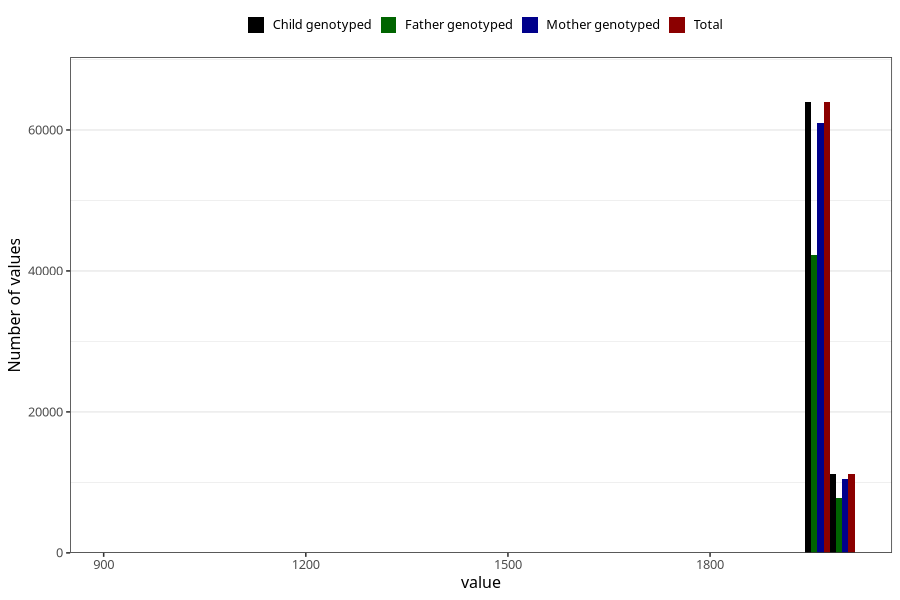

# father_birth_year
Variable mapping to `far_faar_trunkert` in `MFR_541_v12`.
- Number of values:

| Value | Total | Child genotyped | Mother genotyped | Father genotyped |
| ----- | ----- | --------------- | ---------------- | ---------------- |
| Missing | 191 | 191 | 178 | 52 |
| Non-missing | 75117 | 75117 | 71472 | 50032 |
| 25th percentile | 1968 | 1968 | 1968 | 1969 |
| 50th percentile | 1972 | 1972 | 1972 | 1973 |
| 75th percentile | 1976 | 1976 | 1976 | 1976 |
| Mean | 1971.39405194563 | 1971.39405194563 | 1971.35371893889 | 1972.1359929645 |
| Standard deviation | 22.3161367347167 | 22.3161367347167 | 22.5272805879648 | 12.3346295187356 |
| N | 75117 | 75117 | 71472 | 50032 |

