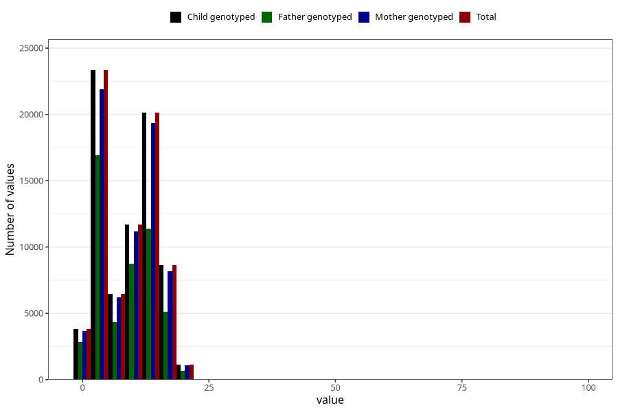

# mother_county_residence_delivery
Variable mapping to `BOFYLKE` in `MFR_541_v12`.
- Number of values:

| Value | Total | Child genotyped | Mother genotyped | Father genotyped |
| ----- | ----- | --------------- | ---------------- | ---------------- |
| Missing | 61 | 61 | 57 | 40 |
| Non-missing | 75247 | 75247 | 71593 | 50044 |
| 25th percentile | 3 | 3 | 3 | 3 |
| 50th percentile | 10 | 10 | 11 | 9 |
| 75th percentile | 12 | 12 | 12 | 12 |
| Mean | 8.86666578069558 | 8.86666578069558 | 8.88487701311581 | 8.40178642794341 |
| Standard deviation | 5.58674523503231 | 5.58674523503231 | 5.58061577082497 | 5.55158898741807 |
| N | 75247 | 75247 | 71593 | 50044 |

