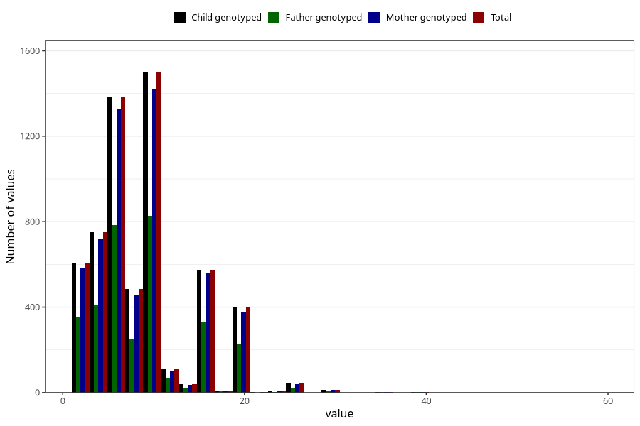

# mother_smoking_beginning_cigarettes_per_day
Variable mapping to `ROYK_BEG_ANT` in `MFR_541_v12`.
- Number of values:

| Value | Total | Child genotyped | Mother genotyped | Father genotyped |
| ----- | ----- | --------------- | ---------------- | ---------------- |
| Missing | 69377 | 69377 | 65987 | 46767 |
| Non-missing | 5931 | 5931 | 5663 | 3317 |
| 25th percentile | 5 | 5 | 5 | 5 |
| 50th percentile | 7 | 7 | 7 | 7 |
| 75th percentile | 10 | 10 | 10 | 10 |
| Mean | 8.40448490979599 | 8.40448490979599 | 8.40614515274589 | 8.43563460958698 |
| Standard deviation | 5.43222290130635 | 5.43222290130635 | 5.4520462740586 | 5.51627452879793 |
| N | 5931 | 5931 | 5663 | 3317 |

