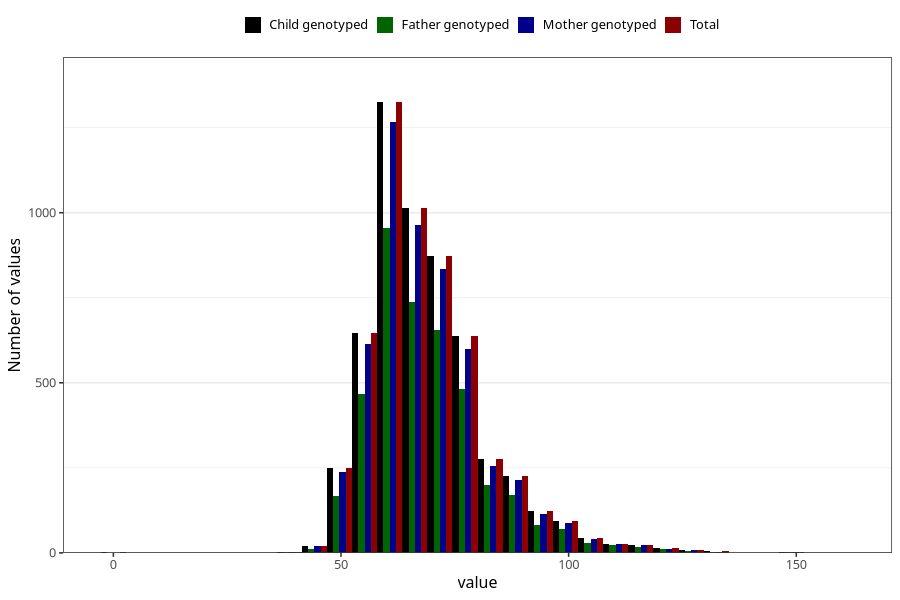

# mother_weight_before
Variable mapping to `MORS_VEKT_FOER` in `MFR_541_v12`.
- Number of values:

| Value | Total | Child genotyped | Mother genotyped | Father genotyped |
| ----- | ----- | --------------- | ---------------- | ---------------- |
| Missing | 69689 | 69689 | 66315 | 45993 |
| Non-missing | 5619 | 5619 | 5335 | 4091 |
| 25th percentile | 60 | 60 | 60 | 60 |
| 50th percentile | 66 | 66 | 66 | 66 |
| 75th percentile | 75 | 75 | 75 | 75 |
| Mean | 68.811888236341 | 68.811888236341 | 68.7242736644799 | 68.9511121975067 |
| Standard deviation | 13.2429724767076 | 13.2429724767076 | 13.1331290576629 | 13.1046215409271 |
| N | 5619 | 5619 | 5335 | 4091 |

