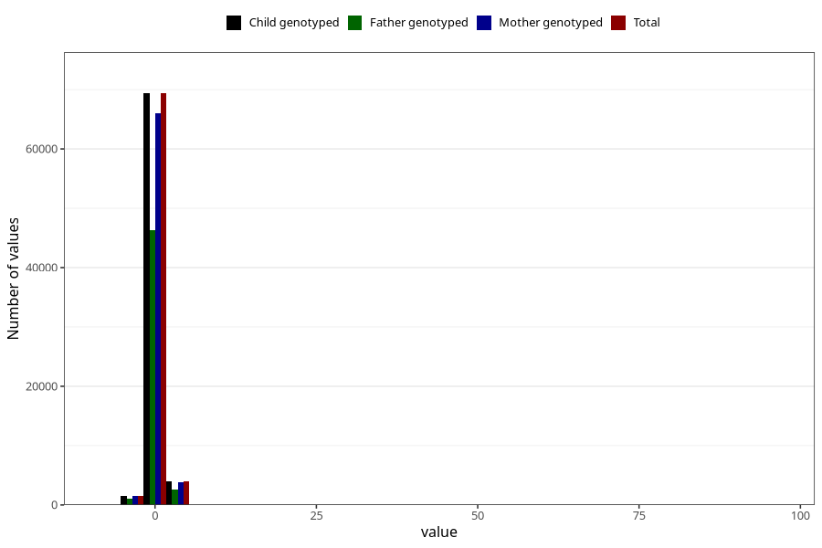

# weight_birth_z_ga
Variable mapping to `ZSCORE_BW_GA` in `MFR_541_v12`.
- Number of values:

| Value | Total | Child genotyped | Mother genotyped | Father genotyped |
| ----- | ----- | --------------- | ---------------- | ---------------- |
| Missing | 355 | 355 | 342 | 230 |
| Non-missing | 74953 | 74953 | 71308 | 49854 |
| 25th percentile | -0.52 | -0.52 | -0.52 | -0.52 |
| 50th percentile | 0.1 | 0.1 | 0.1 | 0.1 |
| 75th percentile | 0.76 | 0.76 | 0.76 | 0.74 |
| Mean | 0.143547156217897 | 0.143547156217897 | 0.14346454815729 | 0.137382757652345 |
| Standard deviation | 1.08263924547929 | 1.08263924547929 | 1.08854779691127 | 1.06355955983673 |
| N | 74953 | 74953 | 71308 | 49854 |

