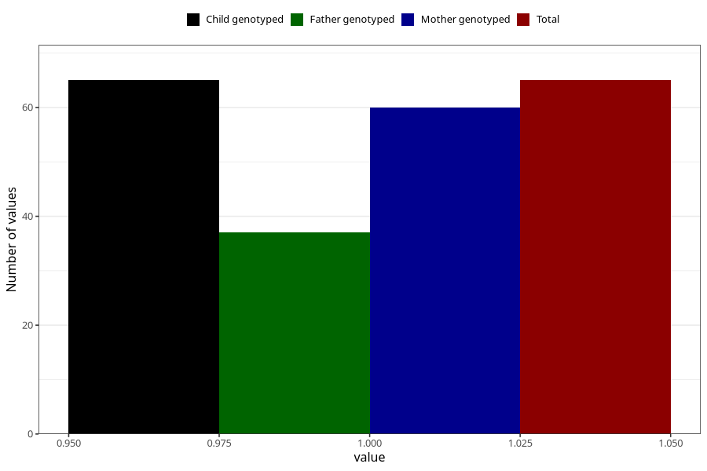

# amphetamine_before
Variable mapping to `AA1438` in `Skjema1_v12`.
- Number of values:

| Value | Total | Child genotyped | Mother genotyped | Father genotyped |
| ----- | ----- | --------------- | ---------------- | ---------------- |
| Missing | 75243 | 75243 | 71590 | 50047 |
| Non-missing | 65 | 65 | 60 | 37 |
| 1 | 65 | 65 | 60 | 37 |

